### `shabul@github ~ $ ./contributions.sh`

 

### `shabul@github ~ $ whoami`

 

`Machine learning` · `LLMs & agents` · `Generative AI` · `Production systems`

I build AI systems that make complex work simpler, from retrieval and agentic workflows to reliable machine learning platforms.

[Portfolio](https://shabul.github.io/) · [LinkedIn](https://www.linkedin.com/in/shabul/) · [Email](mailto:abdul.shabul@outlook.com)

